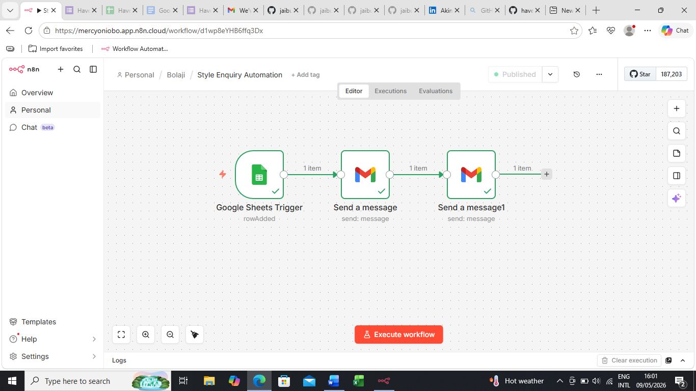

# Haven Fashion Enquiry System

An automated customer enquiry workflow built with n8n 
for a fashion business.

## What It Does
- Captures customer enquiries via Google Form
- Automatically logs all enquiries to Google Sheets
- Sends instant email replies to customers
- Captures and acknowledges customer complaints automatically
- Alerts business owner instantly with full complaint details

## Tools Used
- n8n (workflow automation)
- Google Forms (enquiry capture)
- Google Sheets (data logging)
- Gmail (automated replies)

## Problem It Solves
Manual enquiry management is slow and inconsistent.
This workflow ensures every customer gets an instant 
response with zero manual effort.

## Workflow Screenshot

